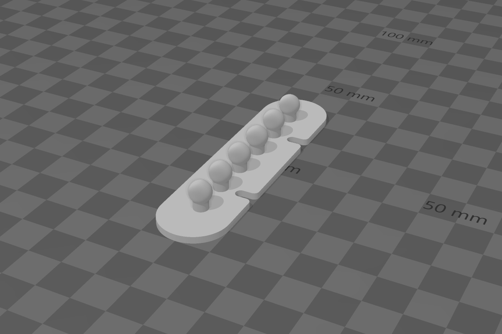
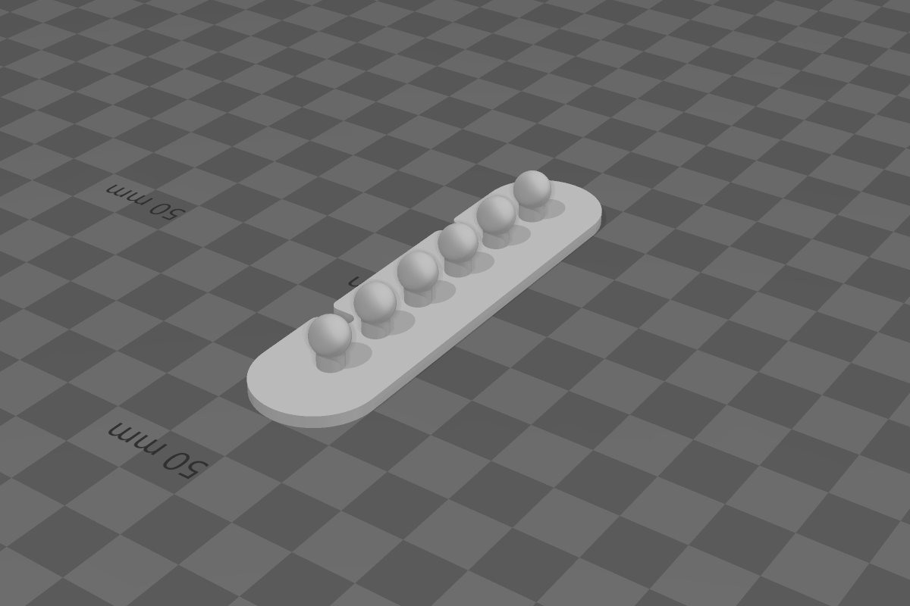
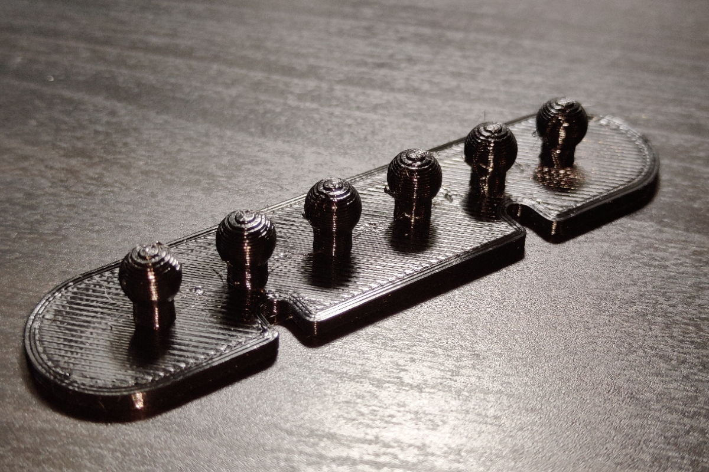
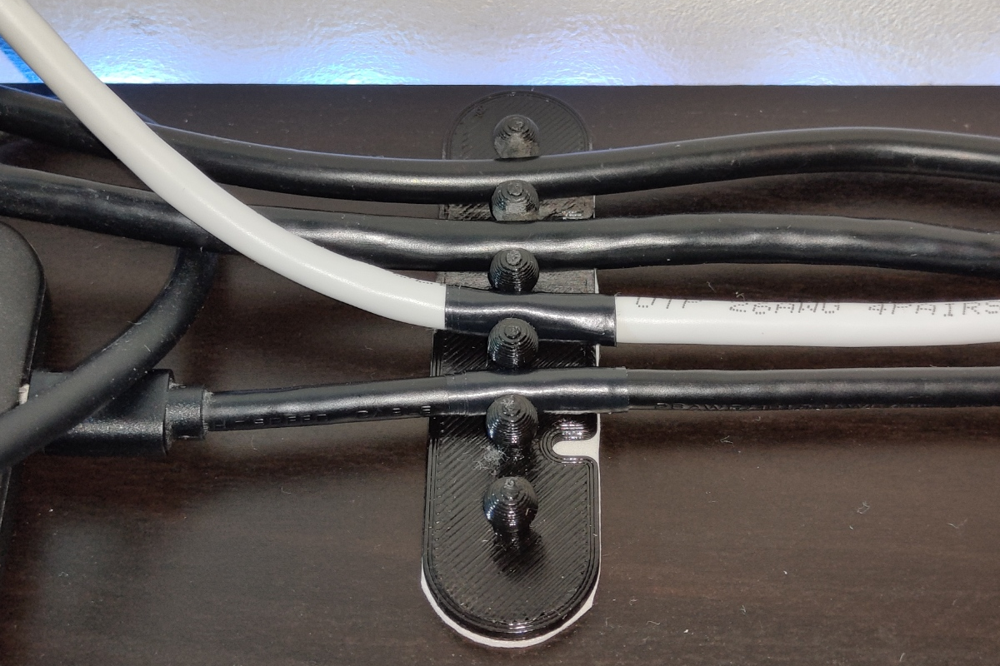
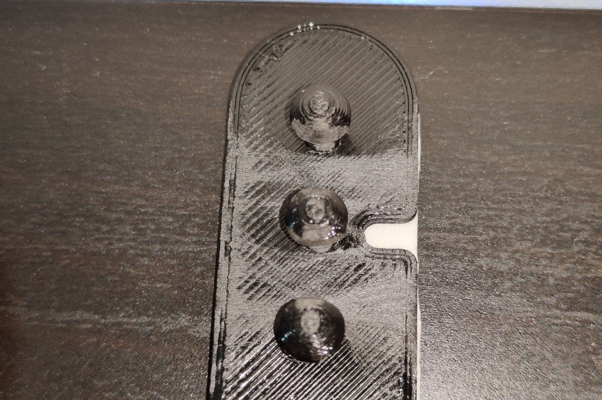

# Author: Narothe
Dimensions (in millimeters):
- X: 20
- Y: 10.15
- Z: 80

Model tested. Comments:
- Some wires may be too large for this organizer. I recommend then to use sandpaper and grind the side surface of the balls, so that the wire enters without problems
- Sometimes it can also happen that the cable is too small. I recommend then to wrap the part of the cable that will be in contact with the balls with tape (preferably insulating).
- You can stick double-sided tape or foam double-sided tape underneath. You can also screw small screws into the current holes (I have not tested this)

Real life Photos:

By using this model you take full responsibility for any malfunctions or other probelms during the use of this model. 
In case of problems, please send me a message.